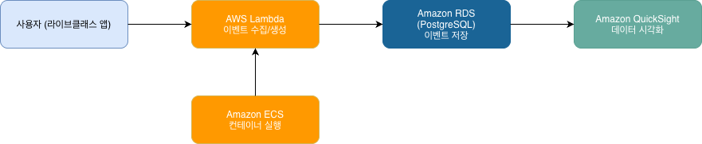

# 라이브클래스 코딩 과제 — 이벤트 로그 파이프라인

## 개요

교육 플랫폼에서 발생하는 이벤트 로그(영상 재생, 에러)를 수집하고 저장하고 분석하는 파이프라인을 구축했습니다.

---

## 구현한 것

- 이벤트 생성기 (Python) — 랜덤 이벤트 100개 생성
- PostgreSQL DB 저장 — 이벤트 타입별 테이블 분리
- 분석 쿼리 3개 (SQL)
- Docker Compose — 명령어 하나로 전체 실행
- 시각화 차트 3개 (matplotlib)

---

## 이벤트 생성기 설계 의도

라이브클래스는 교육 플랫폼이기 때문에 실제 서비스에서 자주 발생할 법한 이벤트 2가지를 선택했습니다.

**video_play (영상 재생)**
- 유저가 강의 영상을 재생할 때 발생하는 이벤트
- 어떤 강좌의 어떤 영상을 얼마나 봤는지 추적
- `video_id`, `course_id`, `watch_seconds` 필드로 구성

**error (에러 발생)**
- 서비스 이용 중 발생하는 에러 이벤트
- 어떤 페이지에서 어떤 에러가 발생했는지 추적
- `error_code`, `error_message`, `page_url` 필드로 구성

두 이벤트는 공통 필드(event_id, event_type, user_id, timestamp)를 공유하고, 타입별 전용 필드는 별도 테이블로 분리했습니다. 실제 서비스에서도 이런 구조로 이벤트를 수집하면 타입별로 독립적으로 관리하면서 필요할 때 JOIN해서 분석할 수 있습니다.

에러 이벤트의 `page_url`은 라이브클래스 서비스의 실제 주요 페이지(대시보드, 라이브 강의, VOD 강의, 결제, 마이페이지)를 기반으로 설계했습니다.

---

## 실행 방법

### 사전 준비

- Docker Desktop 설치 및 실행
- Python 3.11+

### 1. 레포 클론

```bash
git clone https://github.com/jjjuni-0818/liveklass-assignment.git
cd liveklass-assignment
```

### 2. 한번에 실행 (Docker Compose)

```bash
docker-compose up
```

이 명령어 하나로:
- PostgreSQL DB 자동 실행
- 테이블 자동 생성 (init.sql)
- 이벤트 100개 생성 후 DB 저장

### 3. 시각화 차트 생성 (로컬)

```bash
# 가상환경 생성 및 활성화
python3 -m venv venv
source venv/bin/activate

# 패키지 설치
pip install -r requirements.txt

# DB가 실행 중인 상태에서
docker-compose up db        # 터미널 1
python3 src/visualize.py    # 터미널 2
```

차트 파일 3개가 생성됩니다:
- `chart_event_type.png` — 이벤트 타입별 발생 횟수 (파이 차트)
- `chart_user_events.png` — 유저별 총 이벤트 수 (막대 차트)
- `chart_video_avg.png` — 강의별 평균 시청 시간 (막대 차트)

---

## DB 스키마 설계

```sql
events              -- 공통 필드 (모든 이벤트)
video_play_events   -- 영상 재생 전용 필드
error_events        -- 에러 전용 필드
```

### 왜 테이블을 분리했나

이벤트 타입마다 필요한 필드가 다릅니다.

하나의 테이블에 다 합치면 `video_play` 이벤트에 `error_code`가, `error` 이벤트에 `video_id`가 NULL로 채워집니다. 여러 데이터를 한 테이블에 몰아넣으면 볼 때 어디가 어딘지 파악하기 힘들었습니다.

테이블을 분리하면 각 이벤트 타입에 필요한 필드만 들어가서 한눈에 어떤 데이터인지 보이고, `event_id`로 연결해서 필요할 때 JOIN도 가능합니다.

---

## 분석 쿼리

```sql
-- 1. 이벤트 타입별 발생 횟수
SELECT event_type, COUNT(*)
FROM events
GROUP BY event_type;

-- 2. 유저별 총 이벤트 수 (많은 순)
SELECT user_id, COUNT(*)
FROM events
GROUP BY user_id
ORDER BY count DESC;

-- 3. 강의별 평균 시청 시간
SELECT video_id, AVG(watch_seconds)
FROM video_play_events
GROUP BY video_id
ORDER BY avg DESC;
```

---

## 구현하면서 고민한 점

### 1. Docker Compose에서 DB 연결 문제

이전 프로젝트에서도 Docker Compose 연결 문제로 헷갈렸던 적이 있었는데, 오랜만에 쓰다 보니 같은 에러가 다시 떴습니다.

`host="localhost"`로 작성했는데 연결이 안 됐습니다. Docker Compose에서는 각 컨테이너가 독립된 네트워크를 갖기 때문에 `app` 컨테이너 입장에서 `localhost`는 자기 자신을 가리킵니다. 서비스 이름이 호스트명이 된다는 걸 떠올리고 `host="db"`로 바꿔서 해결했습니다. 직접 여러 번 부딪혀봐야 확실히 남는 것 같습니다.

### 2. 가상환경 설정

Mac에서 `pip install`을 시도했을 때 시스템 패키지 충돌 경고가 떴습니다. 프로젝트마다 독립된 패키지 환경이 필요하다는 걸 다시 한번 인지하고, `venv`로 가상환경을 만들어서 해결했습니다.

### 3. SQL 쿼리 작성

부트캠프 때 SQL이 가장 어렵게 느껴졌던 부분이었습니다. 이번에 혼자 스키마를 설계하고 쿼리를 직접 짜보니 완벽하진 않지만 이전보다 훨씬 이해가 되는 느낌이었습니다. GROUP BY, AVG 같은 집계 함수를 실제 데이터에 써보니 개념이 더 잘 잡혔습니다.

### 4. 한글 폰트 문제

matplotlib 기본 폰트가 한글을 지원하지 않아 차트 제목이 깨졌습니다. 나눔고딕 폰트를 설치하고 폰트 경로를 직접 지정해서 해결했습니다.

---

## AWS 아키텍처 (선택 과제 B)

이 파이프라인을 AWS로 운영한다면 아래와 같이 구성할 수 있습니다.



| 현재 구현 | AWS 서비스 | 선택 이유 |
|-----------|-----------|---------|
| generator.py | AWS Lambda | 이벤트 수집은 요청이 들어올 때만 실행되면 충분합니다. 항상 켜두는 서버가 필요 없어서 Lambda로 함수 단위로 실행하면 비용 효율적입니다. |
| PostgreSQL | Amazon RDS | 현재 PostgreSQL을 쓰고 있어서 그대로 마이그레이션 가능합니다. 자동 백업, 스케일 업이 가능하고 관리 부담이 줄어듭니다. |
| docker-compose | Amazon ECS | 지금 Docker Compose로 컨테이너를 관리하는 구조 그대로 AWS에서 실행할 수 있습니다. Fargate 옵션을 쓰면 서버 관리 없이 컨테이너만 올릴 수 있습니다. |
| visualize.py | Amazon QuickSight | RDS에 직접 연결해서 SQL 결과를 대시보드로 자동 시각화할 수 있습니다. matplotlib으로 매번 스크립트를 돌리는 것보다 실시간으로 볼 수 있어서 운영에 적합합니다. |

---

## 파일 구조

```
liveklass-assignment/
├── src/
│   ├── generator.py    # 이벤트 생성 + DB 저장
│   └── visualize.py    # 차트 생성
├── sql/
│   ├── init.sql        # DB 테이블 생성 SQL
│   └── queries.sql     # 분석 쿼리
├── charts/             # 시각화 차트 이미지
│   ├── chart_event_type.png
│   ├── chart_user_events.png
│   └── chart_video_avg.png
├── docker-compose.yml  # Docker 구성
├── requirements.txt    # Python 패키지 목록
└── README.md
```
